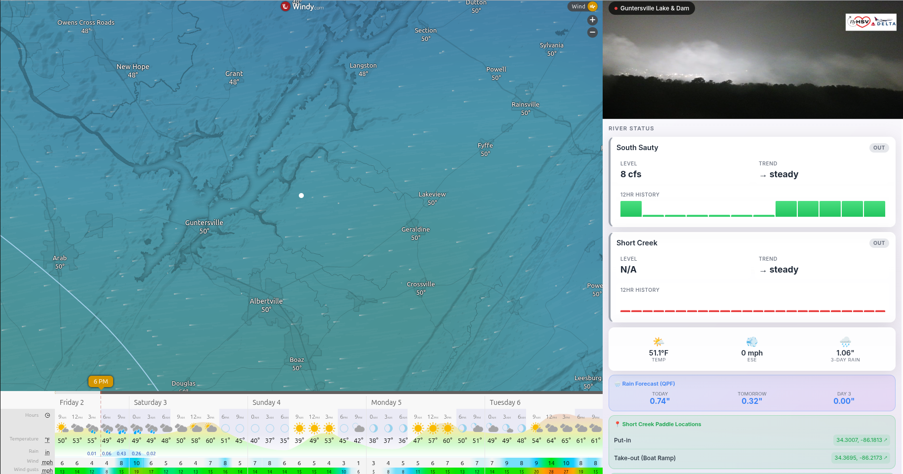

# Paddle Watch

**A beautiful, experimental kayaking dashboard combining live weather maps, webcams, and river data.**


---

## Quick Access - All URLs

| Page | URL |
|------|-----|
| **Main Landing Page** | https://paddle-watch.fly.dev/ |
| Guntersville Area | https://paddle-watch.fly.dev/south-sauty-short-creek |
| Little River Canyon | https://paddle-watch.fly.dev/little-river-canyon |
| Health Check | https://paddle-watch.fly.dev/api/health |

---

## Overview

Paddle Watch is a collection of focused dashboards for monitoring paddling conditions across Alabama. Each river (or group of nearby rivers) has its own dedicated page with:

- **Interactive Wind Map** - Real-time wind visualization from Windy.com
- **Live Webcam/Weather Cam** - Local camera feeds
- **River Status Cards** - Glassmorphism UI showing current levels, trends, and forecasts

### Current River Pages

| Page | Rivers | Webcam |
|------|--------|--------|
| [Guntersville Area](https://paddle-watch.fly.dev/south-sauty-short-creek) | Short Creek, South Sauty | IPCamLive Guntersville |
| [Little River Canyon](https://paddle-watch.fly.dev/little-river-canyon) | Little River Canyon | WAAY 31 Albertville |

### Inspiration

This project was inspired by [Windy.com's webcam interface](https://www.windy.com/-Webcams) - the beautiful split-panel layout with weather data, maps, and live camera feeds. We adapted this concept specifically for kayakers.

---

## Screenshots

### Index Landing Page

```
┌────────────────────────────────────────────────────────────┐
│                                                            │
│                      PADDLE WATCH                          │
│           Real-time dashboards for Alabama                 │
│                    kayaking spots                          │
│                                                            │
│   ┌─────────────────────┐   ┌─────────────────────┐       │
│   │  🌊 Guntersville    │   │  🏔 Little River    │       │
│   │                     │   │     Canyon          │       │
│   │  Short Creek        │   │                     │       │
│   │  South Sauty        │   │  6-Level Guide      │       │
│   │                  →  │   │                  →  │       │
│   └─────────────────────┘   └─────────────────────┘       │
│                                                            │
└────────────────────────────────────────────────────────────┘
```

### River Dashboard Layout



---

## Architecture

### System Diagram

```
┌────────────────────────────────────────────────────────────────┐
│                     PADDLE WATCH (Fly.io)                      │
│                     paddle-watch.fly.dev                       │
│                                                                │
│  ┌──────────────────────────────────────────────────────────┐  │
│  │                    Flask App (app.py)                    │  │
│  │                                                          │  │
│  │  GET /                      → Index landing page         │  │
│  │  GET /south-sauty-short-creek → Guntersville dashboard   │  │
│  │  GET /little-river-canyon   → LRC dashboard              │  │
│  │                                                          │  │
│  │  GET /api/rivers            → Short Creek + South Sauty  │  │
│  │  GET /api/river/lrc         → Little River Canyon        │  │
│  │  GET /api/health            → Health check               │  │
│  └──────────────────────────────────────────────────────────┘  │
└────────────────────────────────────────────────────────────────┘
                              │
          ┌───────────────────┼───────────────────┐
          ↓                   ↓                   ↓
┌──────────────────┐ ┌──────────────────┐ ┌──────────────────┐
│   Windy.com      │ │   Webcams        │ │ River Levels API │
│   Embed API      │ │                  │ │ docker-blue-...  │
│   (iframe)       │ │ • IPCamLive      │ │ .fly.dev         │
│                  │ │   Guntersville   │ │                  │
│ • Wind animation │ │ • WAAY 31        │ │ • Short Creek    │
│ • Temperature    │ │   Albertville    │ │ • South Sauty    │
│ • Pressure       │ │                  │ │ • LRC            │
│ • Free tier      │ │                  │ │ • Weather + QPF  │
└──────────────────┘ └──────────────────┘ └──────────────────┘
```

### Data Flow

1. **User visits** `https://paddle-watch.fly.dev/`
2. **Flask serves** index page with links to river dashboards
3. **User clicks** a river card to view that dashboard
4. **Browser loads**:
   - Windy.com wind map (iframe, centered on river location)
   - Webcam feed (iframe or auto-refreshing image)
5. **JavaScript fetches** river data every 60 seconds
6. **Flask proxies** request to main river API (`docker-blue-sound-1751.fly.dev`)
7. **Dashboard updates** with latest river levels, weather, QPF

---

## River Pages

### South Sauty & Short Creek (`/south-sauty-short-creek`)

- **Location**: Guntersville, Alabama area
- **Map Center**: 34.39, -86.16
- **Webcam**: IPCamLive Guntersville Lake & Dam
- **Rivers**: Short Creek (StreamBeam), South Sauty (USGS)

### Little River Canyon (`/little-river-canyon`)

- **Location**: Fort Payne / DeKalb County, Alabama
- **Map Center**: 34.37, -85.63
- **Webcam**: WAAY 31 Albertville (Sand Mountain)
- **Rivers**: Little River Canyon (USGS 02399200)

**Special 6-Level Classification for LRC:**

| CFS Range | Status | Color |
|-----------|--------|-------|
| < 250 | Not Runnable | Gray |
| 250-400 | Good Low | Yellow |
| 400-800 | Shitty Medium | Brown |
| 800-1,500 | Good Medium | Light Green |
| 1,500-2,500 | **BEST!** | Green |
| > 2,500 | Too High | Red |

---

## Webcam Sources

### IPCamLive - Guntersville (iframe)

```html
<iframe
  src="https://www.ipcamlive.com/player/player.php?alias=guntersville2&autoplay=1"
  allowfullscreen
  allow="autoplay; fullscreen">
</iframe>
```

### WAAY 31 - Albertville (auto-refresh image)

```html

<script>
  setInterval(() => {
    document.getElementById('weather-cam').src =
      'https://ftp2.waaytv.com/weather/31albertville.jpg?t=' + Date.now();
  }, 60000);
</script>
```

**Available WAAY 31 Cameras:**

| Location | URL |
|----------|-----|
| Albertville | `https://ftp2.waaytv.com/weather/31albertville.jpg` |
| Guntersville | `https://ftp2.waaytv.com/weather/31guntersville.jpg` |
| Decatur | `https://ftp2.waaytv.com/weather/31decatur.jpg` |
| Muscle Shoals | `https://ftp2.waaytv.com/weather/31shoals.jpg` |

---

## File Structure

```
/chanslor/mdc/YOUTUBE/paddle-watch/
├── app.py                    # Flask application
│                             # - Index page with river cards
│                             # - Route for each river dashboard
│                             # - API endpoints for river data
│
├── templates/
│   ├── index.html            # Landing page with river cards
│   ├── south-sauty-short-creek.html  # Guntersville dashboard
│   └── little-river-canyon.html      # LRC dashboard
│
├── requirements.txt          # Python dependencies
├── fly.toml                  # Fly.io deployment config
├── Containerfile             # Docker/Podman build
├── deploy.sh                 # One-command deployment
├── README.md                 # This documentation
├── CLAUDE.md                 # AI assistant context
└── DEVELOPMENT_NOTES.md      # Research & decisions
```

---

## API Endpoints

### Pages

| Route | Description |
|-------|-------------|
| `GET /` | Index landing page |
| `GET /south-sauty-short-creek` | Guntersville area dashboard |
| `GET /little-river-canyon` | LRC dashboard |

### Data Endpoints

| Route | Description |
|-------|-------------|
| `GET /api/health` | Health check |
| `GET /api/rivers` | Short Creek + South Sauty data |
| `GET /api/rivers/<page_id>` | Data for specific page |
| `GET /api/river/lrc` | Little River Canyon data |

### Example Response (`/api/river/lrc`)

```json
{
  "name": "Little River Canyon",
  "color": "#f59e0b",
  "data": {
    "flow": "96 cfs",
    "flow_cfs": 96,
    "trend": "v falling",
    "in_range": false,
    "weather": {
      "temp_f": 41,
      "wind_mph": 6.0,
      "wind_dir": "WNW"
    },
    "qpf": {
      "today": 0.02,
      "tomorrow": 0.00,
      "day3": 0.00
    }
  }
}
```

---

## Deployment

### Deploy to Fly.io

```bash
/chanslor/mdc/YOUTUBE/paddle-watch/deploy.sh
```

### Local Development

```bash
cd /chanslor/mdc/YOUTUBE/paddle-watch

# Build container
podman build -t paddle-watch:latest .

# Run locally
podman run -d --name paddle-watch -p 8081:8080 localhost/paddle-watch:latest

# View at http://localhost:8081

# Stop and remove
podman stop paddle-watch && podman rm paddle-watch
```

### Fly.io Management

```bash
fly status -a paddle-watch
fly logs -a paddle-watch
fly apps restart paddle-watch
```

---

## Adding New Rivers

### 1. Add to `app.py` RIVER_PAGES dict:

```python
RIVER_PAGES = {
    # ... existing pages ...
    "new-river": {
        "title": "New River",
        "template": "new-river.html",
        "rivers": {
            "newriver": {
                "name": "New River",
                "api_path": "/api/river-levels/SITE_ID",
                "color": "#hexcolor",
            }
        }
    }
}
```

### 2. Add route in `app.py`:

```python
@app.route("/new-river")
def new_river():
    return render_template("new-river.html")
```

### 3. Create template `templates/new-river.html`

Copy an existing template and customize:
- Update Windy.com iframe coordinates
- Update webcam source
- Update API endpoint in JavaScript

### 4. Add card to `templates/index.html`

### 5. Deploy

```bash
/chanslor/mdc/YOUTUBE/paddle-watch/deploy.sh
```

---

## Costs

| Resource | Cost |
|----------|------|
| Fly.io Compute | ~$0/month (auto-stops when idle) |
| Windy.com Embed | FREE |
| IPCamLive Webcam | FREE |
| WAAY 31 Cameras | FREE |
| **Total** | **~$0/month** |

---

## Related Projects

- **[USGS River Levels](https://docker-blue-sound-1751.fly.dev/)** - Main river monitoring dashboard & API
- **[chanslor-usgs-river-levels](../chanslor-usgs-river-levels/docker/)** - Source repository

---

## Credits

- **Windy.com** - Weather visualization
- **IPCamLive** - Guntersville webcam
- **WAAY 31** - Albertville weather camera
- **USGS** - River gauge data
- **NWS** - Weather and QPF data
- **Weather Underground** - PWS weather stations

---

## License

Personal project - not for redistribution.

---

*Created December 29, 2025*
*Built with Claude Code*
